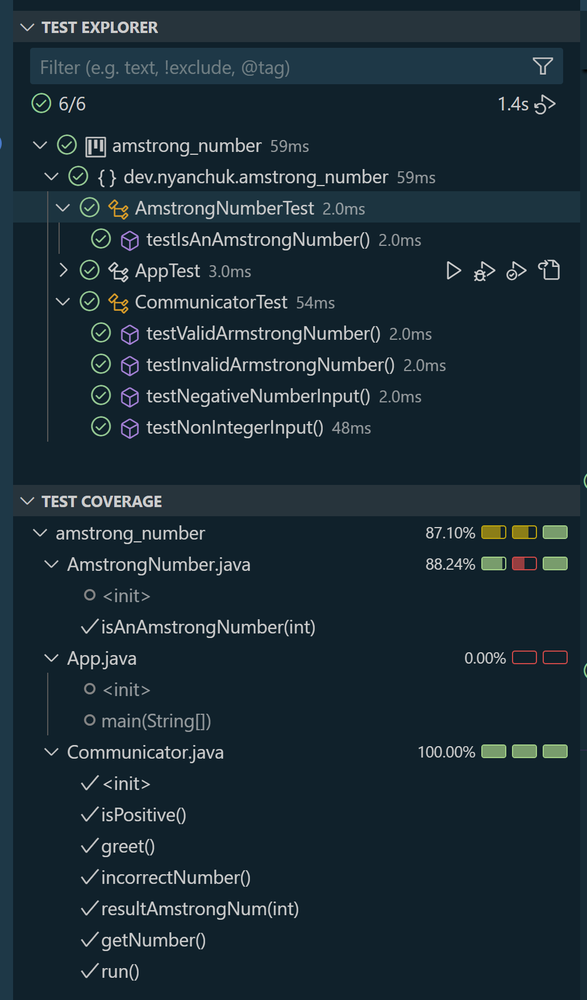

# Java Armstrong Number Checker

## Project Description

The **Java Armstrong Number Checker** is a console-based Java application that determines if a given number is an Armstrong number. An Armstrong number is a number that equals the sum of its digits raised to the power of the number of digits.

### Example:
For instance, 371 is an Armstrong number because it has three digits, and:

    371 = 3^3 + 7^3 + 1^3 = 27 + 343 + 1 = 371

## Project Requirements

The program must:
1. Verify if a number is an Armstrong number by calculating the sum of its digits raised to the power of the total digit count.
2. Provide console output to confirm if the entered number is an Armstrong number.

### Test Requirements:
- The project includes tests to verify:
   - Two positive cases: **371** and **1634**
   - Two negative cases: **351** and **2015**
   - Two incorrect cases: **-10** and **abc**

### Deliverables:
- **GitHub Repository**: [Project Repository](https://github.com/NelliYanchuk/java-armstrong-number)
- **Testing Screenshot**: A screenshot from Visual Studio Code showing the code coverage of the tests.

## Setup and Usage

### Prerequisites

Make sure you have:
- **Java Development Kit (JDK) 8** or higher installed.

### Installation and Running the Application

1. **Clone the Repository**:

       git clone https://github.com/NelliYanchuk/java-amstrong-number.git

2. **Navigate to the Project Directory**:

       cd java-amstrong-number

3. **Compile the Program**:

       javac -d bin src/dev/nyanchuk/amstrong_number/*.java

4. **Run the Application**:

       java -cp bin dev.nyanchuk.amstrong_number.App

### Expected Output

The application will prompt you to enter a number, then display whether the entered number is an Armstrong number.

## Testing

### Requirements:
- Achieve at least 70% code coverage.

### Code Coverage

In Visual Studio Code, navigate to the **Testing** section to run tests and observe code coverage.

Also you can find the test coverage screenshot here: `images/test-cover-amstrong.png`

## Connect with Me:

- [GitHub](https://github.com/NelliYanchuk)
- [LinkedIn](https://www.linkedin.com/in/nelli-yanchuk-a24b81138/)
